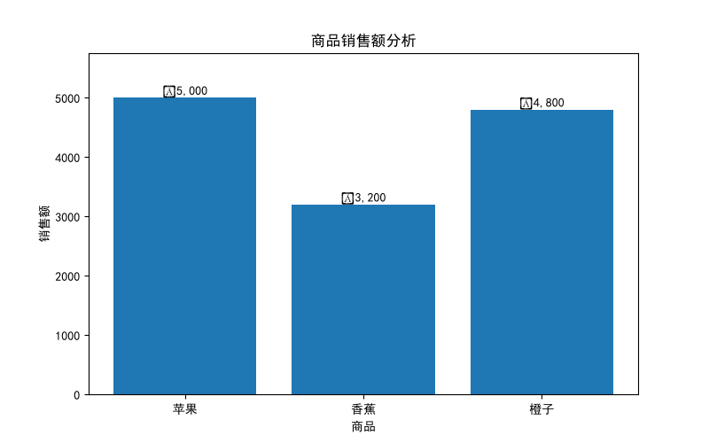
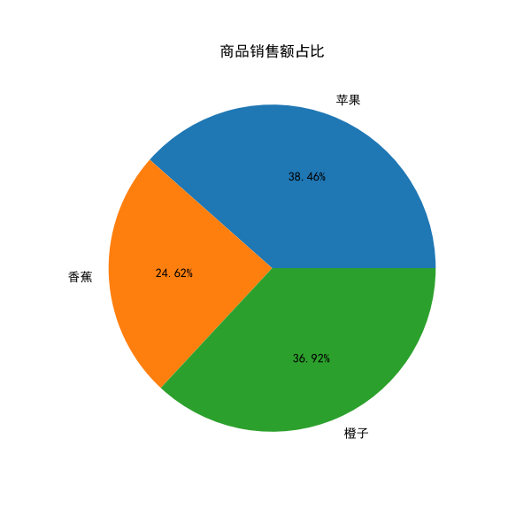

# AI Data Analyst

基于 Python 的智能数据分析项目。

本项目实现了从 CSV 数据读取、数据处理、指标分析到数据可视化展示的完整流程。

目前主要针对销售数据进行分析，实现基础数据统计、销售指标计算以及可视化图表生成。

后续计划扩展 AI 自动分析能力，实现智能数据分析助手。


---

## 项目功能

## 数据处理

实现：

- CSV 文件读取
- Pandas 数据处理
- 数据结构分析
- 数据指标计算


## 数据分析

目前实现：

- 数据行数统计
- 数据列数统计
- 平均销量计算
- 最大销量计算
- 最小销量计算
- 销售额最高商品分析
- 商品销售额排行榜
- 商品销售额占比分析


## 数据可视化

使用 Matplotlib 实现：

- 商品销售额柱状图
- 商品销售额占比饼图
- 图表自动保存


---

# 项目结构


```
ai-data-analyst

├── app
│   ├── analyzer.py          # 数据分析模块
│   ├── data_loader.py       # 数据读取模块
│   ├── visualization.py     # 数据可视化模块
│   ├── report.py            # 报告生成模块
│   ├── main.py              # 项目入口
│   └── __init__.py
│
├── data
│   ├── raw                  # 原始数据
│   └── processed            # 处理后的数据
│
├── docs                     # 项目文档
│
├── outputs
│   ├── sales_bar.png        # 销售额柱状图
│   └── sales_pie.png        # 销售额占比饼图
│
├── tests                    # 测试代码
│
├── config.py                # 项目配置
├── requirements.txt         # 项目依赖
└── README.md
```


---

# 技术栈


## 开发语言

- Python 3.12


## 数据分析

- Pandas
- NumPy


## 数据可视化

- Matplotlib


## 后续计划

- Seaborn 数据分析增强
- Streamlit 数据分析网页
- LLM 自动数据解读
- AI Data Analyst Assistant


---

# 环境配置


## 创建环境

```bash
conda create -n ai-summer python=3.12
```


## 激活环境

```bash
conda activate ai-summer
```


## 安装依赖

```bash
pip install -r requirements.txt
```


---

# 项目运行


进入项目目录：

```bash
cd Projects/ai-data-analyst
```


运行：

```bash
python -m app.main
```


运行后会：

- 输出数据分析结果
- 计算销售指标
- 生成销售额排行榜
- 生成可视化图表


生成文件：

```
outputs/

├── sales_bar.png

└── sales_pie.png
```


---

# 项目效果


## 销售额柱状图





## 销售额占比饼图





---

# 项目开发记录


当前版本：

- 完成 CSV 数据读取
- 完成销售数据分析模块
- 完成销售指标计算
- 完成 Matplotlib 可视化
- 完成项目模块化结构


后续开发：

- Streamlit 数据分析 Dashboard
- 用户上传 CSV 文件
- 自动生成分析报告
- 接入大语言模型进行数据分析解释
- 构建 AI Data Analyst Assistant


---

# Author


L-xy666


AI-Summer2026 Project